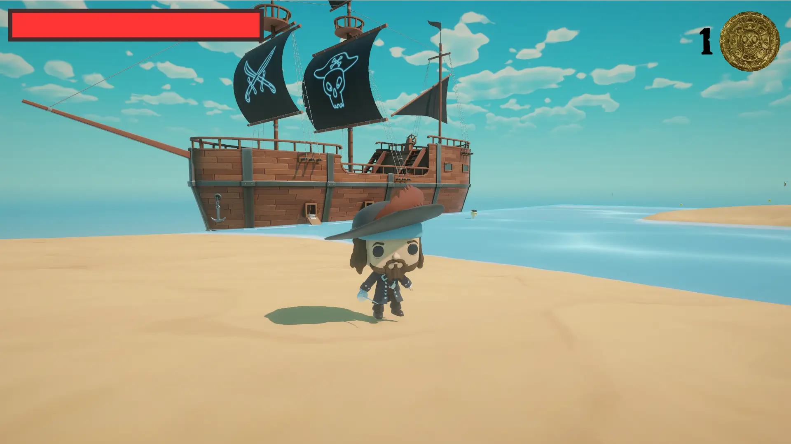
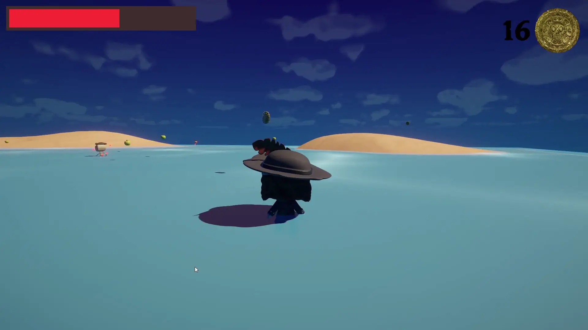

<a id="readme-top"></a>

<!-- PROJECT SHIELDS -->
<!--
*** I'm using markdown "reference style" links for readability.
*** Reference links are enclosed in brackets [ ] instead of parentheses ( ).
*** See the bottom of this document for the declaration of the reference variables
*** https://www.markdownguide.org/basic-syntax/#reference-style-links
-->

<!-- PROJECT LOGO -->
<br />
<div align="center">
<h1 align="center">The Hunt for the Pirate Gold</h1>

  <p align="center">
    A small Unity 3D game.
    <br />
    <a href="https://play.unity.com/en/games/bc3d84a7-e999-4cc6-9696-4c504d7aac91/the-hunt-for-the-pirate-gold"><strong>Play it here</strong></a>
    <br />
  </p>
</div>

<!-- TABLE OF CONTENTS -->
<details>
  <summary>Table of Contents</summary>
  <ol>
    <li>
      <a href="#about-the-project">About The Project</a>
      <ul>
        <li><a href="#built-with">Built With</a></li>
      </ul>
    </li>
    <li>
      <a href="#getting-started">Getting Started</a>
      <ul>
        <li><a href="#prerequisites">Prerequisites</a></li>
        <li><a href="#installation">Installation</a></li>
      </ul>
    </li>
    <li><a href="#usage">Usage</a></li>
    <li><a href="#roadmap">Roadmap</a></li>
    <li><a href="#acknowledgments">Acknowledgments</a></li>
  </ol>
</details>

<!-- ABOUT THE PROJECT -->

## About The Project

<div align="center">
  
  
</div>

I built this project as the final assignment for my Unity course in the 4th semester. The goal was to showcase everything that I learned throughout the course in a small functional game. I also decided to design most of the assets myself.

<p align="right">(<a href="#readme-top">back to top</a>)</p>

### Built With

- [![Unity][Unity.com]][Unity-url]
- [![Blender][Blender.org]][Blender-url]

<p align="right">(<a href="#readme-top">back to top</a>)</p>

<!-- GETTING STARTED -->

## Getting Started

Here you find the instructions on how to set up the project locally.

### Prerequisites

If you want to test the project in the Unity editor and not just view the code, make sure you have the correct version installed:

- [Unity 2021.3.21f1](https://unity.com/releases/editor/archive)

### Installation

1. Clone the repo (or download the project as a zip file)
   ```sh
   git clone https://github.com/alexS317/The-Hunt-for-the-Pirate-Gold.git
   cd The-Hunt-for-the-Pirate-Gold
   ```
2. Open it the project in the Unity editor of the correct version and/or in a code editor of your choice.

<p align="right">(<a href="#readme-top">back to top</a>)</p>

<!-- USAGE EXAMPLES -->

## Usage

In the Unity editor you can change a number of properties, such as the health and attack strength of both player and enemies, the movement and properties of the collectibles or the map size.

<p align="right">(<a href="#readme-top">back to top</a>)</p>

<!-- ROADMAP -->

## Roadmap

- [x] Add basic player and camera movement
- [x] Add map/environment layout
- [x] Add collectibles
- [x] Add enemies and attack functionality
- [x] Add scene management
- [x] Add water shader
- [x] Add decorative elements and final assets

<p align="right">(<a href="#readme-top">back to top</a>)</p>

<!-- ACKNOWLEDGMENTS -->

## Acknowledgments

- Based on [Best README Template](https://github.com/othneildrew/Best-README-Template)

<p align="right">(<a href="#readme-top">back to top</a>)</p>

<!-- MARKDOWN LINKS & IMAGES -->
<!-- https://www.markdownguide.org/basic-syntax/#reference-style-links -->

[product-screenshot-1]: readme-screenshots/the-hunt-for-the-pirate-gold-1.webp
[product-screenshot-2]: readme-screenshots/the-hunt-for-the-pirate-gold-2.webp

<!-- Shields.io badges. You can a comprehensive list with many more badges at: https://github.com/inttter/md-badges -->

[Unity.com]: https://img.shields.io/badge/Unity-grey?style=for-the-badge&logo=unity&logoColor=white
[Unity-url]: https://unity.com/
[Blender.org]: https://img.shields.io/badge/Blender-E87D0D?style=for-the-badge&logo=blender&logoColor=white
[Blender-url]: https://www.blender.org/download/